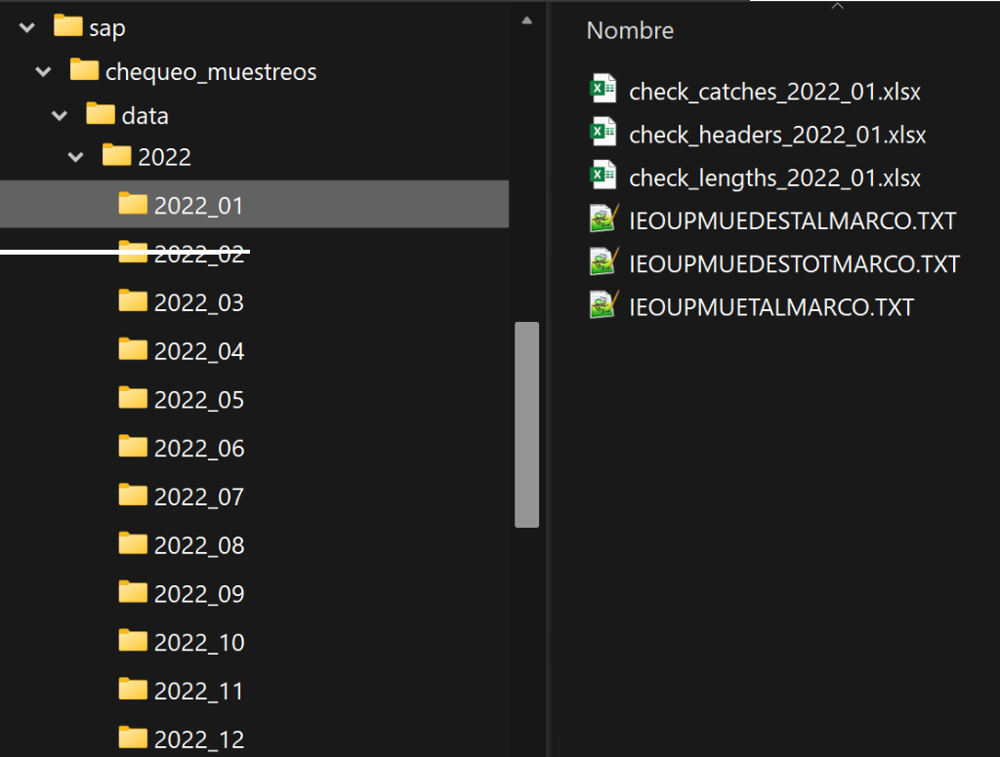

# Generación de ficheros excel para el chequeo de los muestreos MT2 de RIM.
Este script genera los ficheros excel que se usan para realizar el chequeo de 
los muestreos MT2 de RIM.

Se crean los ficheros para chequear:
- las cabeceras de los muestreos (check_headers_2022_01.xlsx)
- los pesos desembarcados por categoría (check_catches_2022_01.xlsx)
- las tallas (check_lengths_2022_01.xlsx)

Cada fichero contiene los campos necesarios que hay que comprobar manualmente 
para considerar los muestreos chequeados.


## Requisitos
Son necesarias las librerías de R *sapmuebase*, *dplyr*, *openxlsx* y *pivottabler*.

Este script consta de los archivos chequeo_muestreos_MT2.R y functions.R.

El script requiere dos de los informes '*tallas por up*' que se obtienen del SIRENO.
En concreto:
- capturas (IEOUPMUEDESTOT.TXT)
- capturas de especies medidas (IEOUPDESTAL.TXT)

Estos informes deben estar ubicados en la carpeta YEAR_MONTH (ver apartado siguiente).


### Estructura de las carpetas
Para el correcto funcionamiento del script se debe tener la siguiente estructura
de carpetas:
```
↳ (carpeta donde se encuentra el script)
      ↳ data
          ↳ YEAR
              ↳ YEAR_MONTH
```
Siendo YEAR el año y MONTH el mes en dígitos. Por ejemplo:




Así, la ruta del archivo de cabeceras del mes de enero de 2022 sería:
```data/2022/2022_01/check_headers_2022_01.xlsx```


Los informes 'tallas por up' deben estar en la carpeta YEAR_MONTH.


## Ejecución del script
Se deben ejecutar todas las líneas de código del fichero chequeo_muestreos_MT2.R.

El script genera los ficheros de chequeo para todos los datos que haya en los
informes de '*tallas por up*'. No realiza ningún filtrado por fecha. Por lo tanto,
si los informes del SIRENO tienen datos de varios meses, los ficheros generados
tendrán información de esos meses.

Sólo es necesario cambiar las variables del apartado `## YOU ONLY HAVE TO CHANGE
THIS VARIABLES`. El resto del script no hay que modificarlo.


## Ficheros finales
Los ficheros generados se guardan en la carpeta YEAR_MONTH con formato .xlsx.
En el caso de que alguno de los ficheros exista, el script preguntará al usuario
si desea reemplazarlos.

Los ficheros generados son:
- check_headers_YEAR_MONTH.xlsx
- check_catches_YEAR_MONTH.xlsx
- check_lengths_YEAR_MONTH.xlsx

Por ejemplo: check_headers_2022_01.xlsx, check_catches_2022_01.xlsx y
check_lengths_2022_01.xlsx


